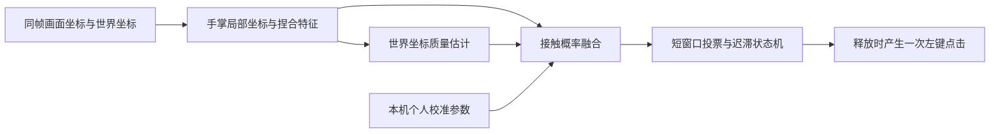

# 自适应捏合识别设计

## 背景与问题

当前左键点击使用两个固定条件：画面坐标捏合比例和世界坐标捏合比例必须同时低于同一个阈值，并且连续保持 48ms。这个方案能拦截“画面中重合、空间中分离”的误触，但也把两个误差分布不同的单目估计量当成了同一种传感器。任意一帧世界坐标抖动都会清空候选，因此真实捏合较难进入锁定状态，用户感受到的结果就是迟钝和漏识别。

MediaPipe 的世界坐标仍是单目模型推断值，不是真实深度传感器读数。继续收紧一个固定阈值无法同时解决召回率和误触率；直接更换为 Gesture Recognizer 也不能解决，因为其内置动作不包含捏合，静态自定义分类器还会丢失“靠近—接触—分开”的时间信息。

## 目标

- 正常正面、侧向和斜向捏合都容易触发。
- 指尖只在二维画面重合、真实空间仍分离时不得点击。
- 一次完整捏合只产生一次左键点击。
- 从真实接触到候选锁定的 P95 延迟不超过 100ms。
- 保持光标移动和张手停止的现有行为。
- 全部推理和校准留在本机，不保存摄像头画面。

## 非目标

- 本阶段不恢复右键、双击、拖动或滚动手势。
- 本阶段不引入新的手势模型或云端推理。
- 不把单目世界坐标描述为物理接触的绝对证明。
- 不为提高点击召回率而放宽张手停止条件。

## 采用方案

保留当前 MediaPipe Hand Landmarker，把“两个固定阈值的硬合取”替换为“多特征概率融合、质量感知降权、短窗口投票和个人校准”。识别链路如下：

### 1. 每帧特征

每一帧生成 `PinchFrameFeatures`：

- `imageRatio`：画面坐标中拇指尖与食指尖距离，按画面手掌尺度归一化。
- `worldRatio`：世界坐标中同一距离，按世界手掌尺度归一化；不可用时为 `null`。
- `imageDepthGap`：两指尖在手掌局部 z 轴上的距离绝对值，按手掌尺度归一化。
- `worldDepthGap`：世界坐标的局部 z 距离；不可用时为 `null`。
- `approachVelocity`：最近两个有效帧的 `imageRatio` 下降速度，单位为“比例/秒”，只使用 8ms 到 80ms 的相邻帧。
- `thumbCurl` 与 `indexCurl`：基于 MCP、PIP、DIP、TIP 路径长度的弯曲程度。
- `contactPoseScore`：指尖接近、拇指与食指末节朝向相向、其余手指姿态不过度约束后的 0–1 分数。
- `frameIntervalMs`：与上一有效帧的时间间隔。

所有距离先转换到现有 `HandGeometry` 的手掌局部坐标，避免手的远近、旋转和镜像直接改变阈值含义。

### 2. 世界坐标质量

`PinchQualityEstimator` 保存最近 5 个有效帧，只评价世界坐标能否在本帧参与融合，不决定点击。质量分数为 0–1，并附带原因：

- 世界坐标缺失或结构无效：质量为 0。
- 相邻帧世界手掌尺度变化超过 18%：降低质量。
- 最近 5 帧掌骨长度变异系数超过 12%：降低质量。
- 最近 5 帧世界捏合比例中位绝对偏差超过 0.08：降低质量。
- 帧间隔大于 80ms：该帧不参与时间投票。

质量不再作为硬否决。质量高时使用世界距离帮助排除二维重合；质量低时降低世界坐标权重，但必须由画面距离、局部深度、靠近运动和接触姿态共同证明，不能只靠一个二维距离产生点击。

### 3. 概率融合

各距离先通过个人校准的进入/退出边界转换为 0–1 接近度。没有个人参数时使用安全种子值：

- 画面比例接触边界 0.34，分离边界 0.50。
- 世界比例接触边界 0.34，分离边界 0.50。
- 画面局部深度接触边界 0.16，分离边界 0.30。

高质量世界坐标（`quality >= 0.60`）使用：

`probability = 0.35 × imageCloseness + 0.25 × worldCloseness + 0.15 × depthCloseness + 0.10 × approachScore + 0.15 × contactPoseScore`

低质量或缺失世界坐标使用：

`probability = 0.45 × imageCloseness + 0.20 × depthCloseness + 0.15 × approachScore + 0.20 × contactPoseScore`

低质量路径还有一个明确安全门：只有 `imageCloseness >= 0.82`、`depthCloseness >= 0.65`、`contactPoseScore >= 0.65`，并且当前短窗口内曾观察到 `approachScore >= 0.55`，概率才允许超过进入阈值。这样可以容忍世界坐标抖动，同时不让静态二维重合直接成为点击。

`gestureSensitivity` 不再同时移动所有原始距离阈值，只对最终进入概率施加最多 ±0.06 的有限偏移，避免高灵敏度破坏防误触条件。

### 4. 时间状态机

左键使用独立的 `PinchTemporalRecognizer`，而张手继续使用现有分类和稳定逻辑。

- `neutral`：未检测到接触。
- `candidate`：高质量路径最近 3 个有效帧至少 2 帧概率不低于 0.72；低质量路径最近 4 帧至少 3 帧满足 0.72 和安全门。
- `active`：候选成立后进入锁定。中间允许 1 个低质量或丢失帧，不立即复位。
- `releasing`：最近 3 个有效帧至少 2 帧概率不高于 0.38。
- `cooldown`：释放时发出一次点击，然后等待 70ms 且概率低于 0.38 才回到 `neutral`。

候选窗口采用投票而不是连续毫秒计时，因此单个抖动帧不会把真实点击从头计时；时间戳仍用于剔除停顿、重复视频帧和超过 80ms 的陈旧帧。未曾进入 `active` 的序列绝不产生点击。

### 5. 个人校准

新增一次约 20 秒、可跳过的中文校准向导：

1. 保持手掌自然移动 3 秒，采集跟踪噪声。
2. 正面完成 5 次捏合。
3. 侧向或斜向完成 5 次捏合。
4. 完成 3 次“画面重合但不要接触”的负样本。

只保存每段的数值特征摘要和最终 `PinchCalibrationProfile`，不保存图片、视频或完整手部坐标。边界用稳健分位数拟合：正样本接触值取第 90 百分位并留 8% 余量，负样本取第 10 百分位；两类边界的最小间隔为 0.06。若正负样本重叠、样本数不足或质量不达标，校准失败并保留安全默认值，不写入半成品配置。

配置包含 `version: 1`、创建时间、画面/世界/深度边界和基准噪声。它存入浏览器本地存储，可在校准面板中重做或清除。配置解析必须严格验证版本、有限数值和边界顺序。

### 6. 诊断与回放

轨迹格式升级到版本 3，继续读取版本 1 和 2。版本 3 每帧记录：

- 原始画面/世界捏合比例和局部深度差。
- 世界质量分、质量原因、接近速度和接触姿态分。
- 最终捏合概率、投票计数和时间状态。
- 帧间隔及推理耗时。

轨迹仍限制为 2 MiB、600 帧、严格字段白名单，不包含摄像头图像。诊断面板用中文显示“接触概率、世界质量、投票、主要阻断原因、有效帧率”，让后续问题能够通过记录定位，而不是再次盲调阈值。

新增离线基准工具读取轨迹并输出：真实点击召回率、负样本误触数、重复点击数、从人工标注接触到 `active` 的延迟和有效帧率。测试夹具上的期望事件由测试代码明确标注，不能由待测算法自动生成。

### 7. 性能门槛

先记录 `detectForVideo` 的耗时和有效视频帧间隔。当前阶段不立即引入 Worker，因为跨线程传输视频帧会增加实现复杂度，而且尚无证据表明主线程是漏识别根因。

- 有效识别帧率必须至少 30fps。
- `detectForVideo` P95 超过 12ms，或连续 10 秒有效帧率低于 30fps 时，才单独启动 Worker 优化计划。
- 状态机完全按时间戳工作，不假设固定 60fps。

### 8. 模型升级门槛

如果完成个人校准后仍无法达到验收指标，再进入第二阶段模型方案：使用 8 帧手部局部坐标和上述派生特征训练轻量时序二分类器，输出接触概率；仍保留安全门和状态机。不会优先使用静态 Gesture Recognizer，也不会采用已弃用的 MediaPipe Model Maker 流程。

只有在至少 10 名用户、每人完整正负样本的匿名特征数据集可用后，才有足够依据训练通用模型。本地第一阶段不收集或上传这些数据。

## 验收标准

- 正样本：至少 200 次真实捏合，覆盖正面/侧面/斜面、近/中/远距离及两种光照；召回率不低于 98%。
- 负样本：连续 30 分钟，包含指尖二维重合但空间分离、握拳、张手、快速经过和手部进出画面；误触不超过 1 次，目标为 0。
- 每次完整捏合只产生 1 次点击，重复点击为 0。
- 接触到锁定的 P95 延迟不超过 100ms。
- 有效识别帧率不低于 30fps，界面和系统光标无可感知卡顿。
- 旧版 v1/v2 轨迹仍可解析和回放；损坏或超限轨迹被拒绝。
- 光标移动和张手停止的现有测试全部不回退。

## 风险与边界

- 普通单目摄像头无法物理证明两指接触。本设计用多种相互独立的时间证据降低误判，而不是声称消除传感器物理限制。
- 校准姿态过少会过拟合，因此必须包含正面、侧面和故意不接触的负样本。
- 低帧率会同时增加延迟和投票不确定性；超过性能门槛时先解决采集/推理调度，再继续调识别参数。
- 任何参数修改必须通过固定回放夹具和真人验收矩阵，不能只凭一次现场观感合入。
